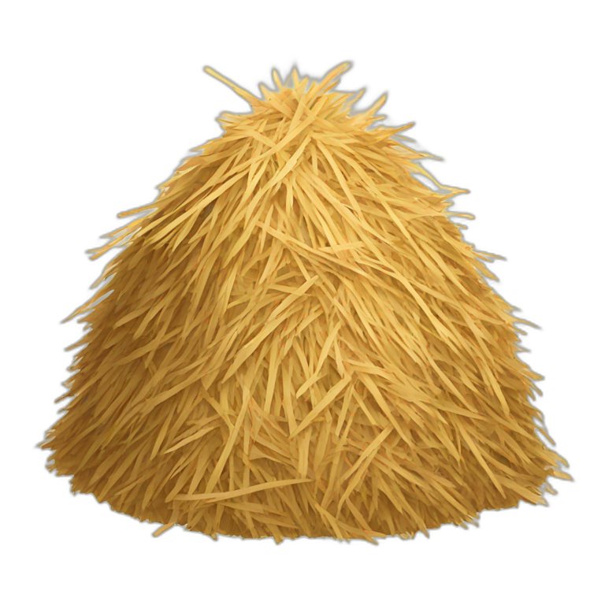
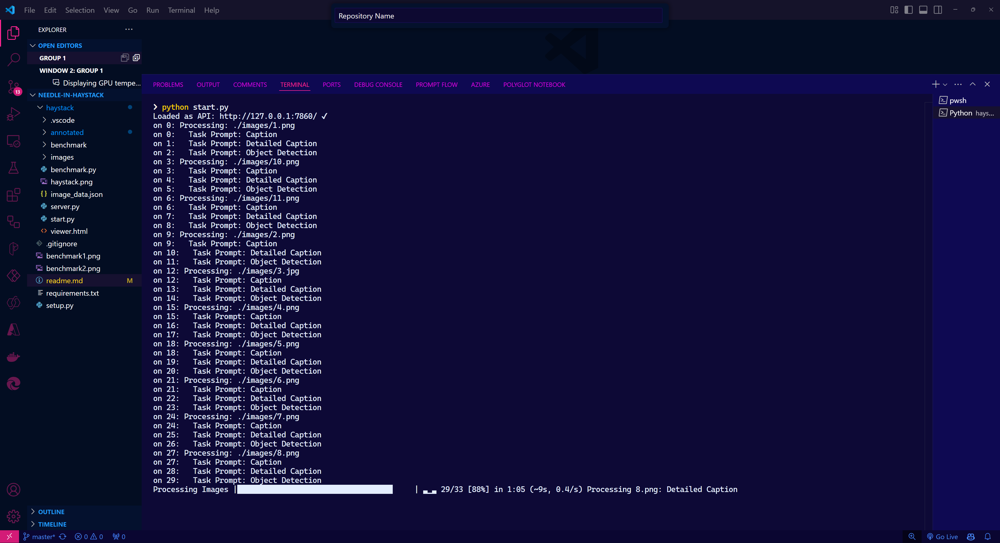
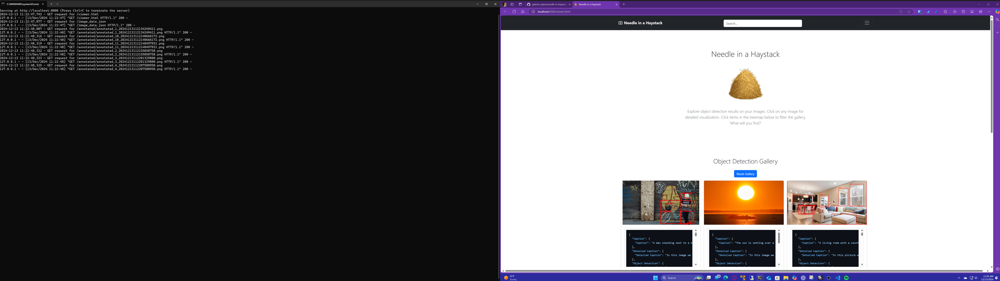
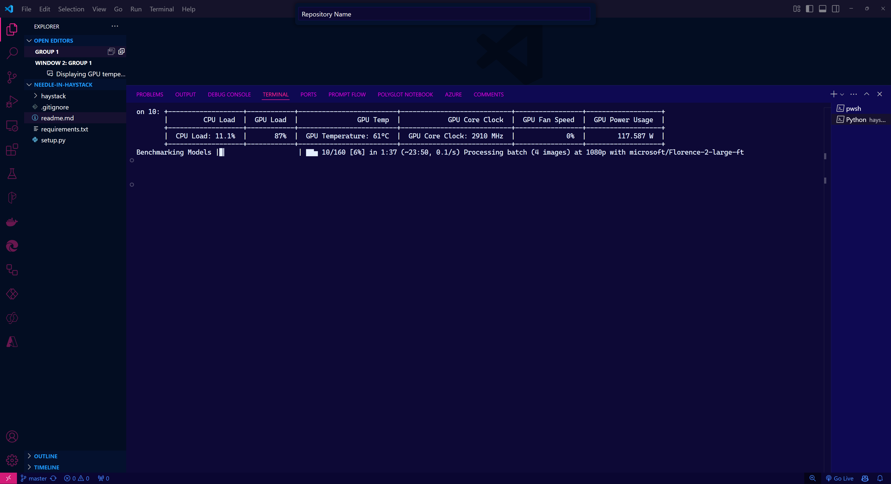

<p align="center">
  
</p>

# 🧵 Needle in a Haystack 🧵

Needle in a Haystack is a project that leverages the Microsoft Florence-2 API to process images and generate an interactive HTML gallery. It performs tasks such as caption generation and object detection, annotating images with bounding boxes and labels for detected objects. The results are formatted into a JSON structure and presented alongside annotated images. Using Bootstrap for styling and D3.js for visualization, the gallery includes a treemap to represent label occurrences, enabling users to filter images by detected objects.

## 📂 Project Structure 📂

```
haystack/
    .vscode/
        extensions.json
    annotated/
    benchmark/
        1080p/
        1440p/
        4K/
        720p/
    benchmark.py
    image_data.json
    images/
    server.py
    start.py
    viewer.html

requirements.txt

setup.py
```

## ⚙️ Setup ⚙️

### 📋 Prerequisites 📋

- Python 3.8 or higher
- pip (Python package installer)
- Florence2 (https://pinokio.computer/item?uri=https://github.com/pinokiofactory/florence2)

### 📥 Installation 📥

1. Clone the repository:

```sh
git clone https://github.com/yourusername/needle-in-haystack.git
cd needle-in-haystack/haystack
```

2. Install the required Python packages:

```sh
python setup.py
```

This will generate the 

requirements.txt

 file and install all dependencies listed in it.

## 🚀 Usage 🚀

### 📥 Installing Pinokio and Downloading Florence2 Model 📥

Before processing images, you need to install Pinokio and download the Florence2 Model.

1. **Install Pinokio:**
   - If Pinokio is not already installed, you can install it using pip:
     ```sh
     pip install pinokio
     ```

2. **Download the Florence2 Model:**
   - After installing Pinokio, download the Florence2 Model by running:
     ```sh
     pinokio download florence2
     ```
   - This will download and set up the Florence2 Model in the appropriate directory.

### 🖼️ Processing Images 🖼️

To process images and generate the annotated results, run:

```sh
python start.py
```

This script will process images in the `images/` directory, generate captions and object detection results, and save the annotated images in the `annotated/` directory. The results will be saved in `image_data.json` and `viewer.html`.

<p align="center">
  
</p>

### 🖥️ Starting the Server 🖥️

To start the server and open the interactive HTML gallery in your browser, run:

```sh
python server.py
```

You will be prompted to open the browser automatically. Type `y` for yes or `n` for no.  If yes, the viewer.html will launch in a browser.  This file was created in the previous step.

<p align="center">
  
</p>

### 📊 Benchmarking Models 📊

To benchmark different Florence models on your images, run:

```sh
python benchmark.py
```

This script will benchmark the models on images in the `benchmark/` directory and display system stats in real-time and give you recommendations based on your computer's performance.

<p align="center">
  <table>
    <tr>
      <td></td>
      <td></td>
    </tr>
  </table>
</p>

## 📄 Project Files 📄

### `start.py`

This script processes images using the Microsoft Florence-2 API, generates captions and object detection results, and saves the annotated images and results.

### `server.py`

This script starts an HTTP server to serve the interactive HTML gallery. It logs GET and POST requests and can open the gallery in the browser automatically.

### `benchmark.py`

This script benchmarks different Florence models on images in the `benchmark/` directory. It displays system stats in real-time and summarizes the benchmark results.

### `viewer.html`

This is the interactive HTML gallery generated by `start.py`. It displays the annotated images and allows users to filter images by detected objects using a treemap.

### `image_data.json`

This file contains the results of the image processing, including captions and object detection results.

### 

requirements.txt


This file lists the Python packages required for the project.

### 

setup.py


This script generates the 

requirements.txt

 file and installs the required Python packages.

### `extensions.json`

This file contains recommended extensions for Visual Studio Code.

## 🤝 Contributing 🤝

Contributions are welcome! Please open an issue or submit a pull request on GitHub.

## 📜 License 📜

This project is licensed under the MIT License. See the LICENSE file for details.

## 👤 Author 👤

Daniel Penrod

- [GitHub](https://github.com/galactic-plane)
- [LinkedIn](https://www.linkedin.com/in/daniel-penrod-sr)

---
Feel free to explore the object detection results on your images and filter the gallery by detected objects. What will you find? 🕵️‍♂️